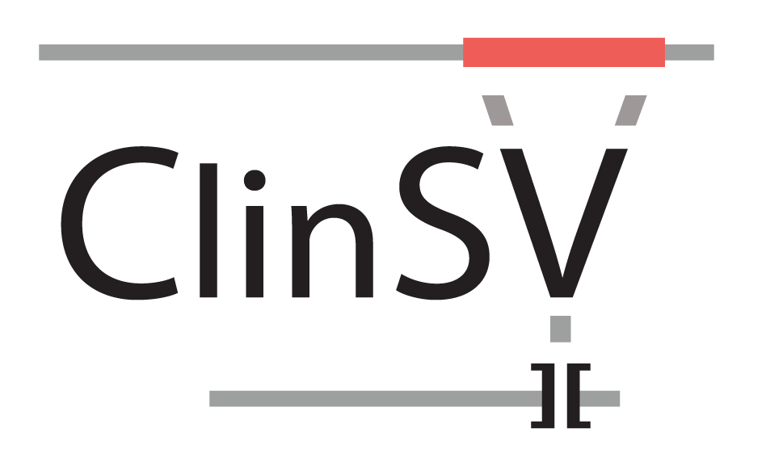

Robust detection of clinically relevant structural and copy number variation from whole genome sequencing data

Microarrays have been the mainstay for detecting clinically relevant copy number variants (CNV) in patients. Whole genome sequencing (WGS) has the potential to provide far higher resolution of CNV detection and to resolve structural variation (SV) invisible to current microarrays. Current WGS-based approaches however have high error rates, poor reproducibility, and difficulties in annotating, visualizing, and prioritizing rare variants. 

We developed ClinSV to overcome these challenges, enabling the use of WGS to identify short, and large CNV and balanced SV, with high analytical sensitivity, reproducibility, and low false positive rates. ClinSV is designed to be easily integrated into production WGS analysis pipelines, and generate output which is easily interpreted by researchers and clinicians. We developed ClinSV mostly in the context of analysing WGS data from a single-lane of an Illumina HiSeq X sequencer, thus ~30-40x coverage. We focused mostly on the use of ClinSV to identify rare, gene-affecting variation in the context of rare genetic disease. We have used it to detect Mitochondrial SV, and somatic SV from tumour-normal paired WGS.

ClinSV has the following features:

* integration of three CNV signals: depth of coverage, split and spanning reads
* extensive quality attributes for CNV and SV
* CNV and copy-number neutral SV are assigned High, Pass, Low quality tranches
* variant segregation if a user-supplied PED file is supplied
* gene and phenotype annotation of each SV
* full, and focussed result tables for easy clinical interpretation
* Quality Control report
* Analytical validaiton report, if NA12878 is being analysed
* Multiple population allele frequency measures to help identify rare variants
* Visualisation framework via IGV and multiple supporting tracks

## Download

Download human genome reference data GRCh37 decoy (hs37d5):

```
wget https://nci.space/clinsv/refdata-b37_v0.9.tar
tar xf refdata-b37_v0.9.tar
refdata_path=$PWD/clinsv/refdata-b37
```

Download a sample bam to test ClinSV:

```
wget https://nci.space/clinsv/NA12878_v0.9.bam
wget https://nci.space/clinsv/NA12878_v0.9.bam.bai
input_path=$PWD
```

The ClinSV software can be downloaded precompiled, as a Singularity image or through Docker. Please refer to the section below.


## Run ClinSV

### Using Singularity
```
wget https://nci.space/clinsv/clinsv.sif 
singularity run clinsv.sif \
  -i "$input_path/*.bam" \
  -ref $refdata_path \
  -p $PWD/project_folder

```

### Using Docker
```
docker pull kccg/clinsv

project_folder=$PWD/test_run

docker run \
-v $refdata_path:/app/ref-data \
-v $project_folder:/app/project_folder \
-v $input_path:/app/input \
  kccg/clinsv -r all \
-i "/app/input/*.bam" \
-ref $refdata_path:/app/ref-data \
-p $project_folder:/app/project_folder
```

### Linux Native

Download precompiled ClinSV bundle for CentOS 6.8 x86_64

```
wget https://nci.space/clinsv/ClinSV_x86_64_v0.9.tar.gz
tar zxf ClinSV_x86_64_v0.9.tar.gz
clinsv_path=$PWD/clinsv

export PATH=$clinsv_path/bin:$PATH
clinsv -r all -p $PWD/project_folder -i "$input_path/*.bam" -ref $refdata_path
```

### Compile dependencies from source
see [INSTALL.md](INSTALL.md)


## Build 38

To run ClinSV on build 38 please use refdata-b38_v1.0.tar with ClinSV v1.0 from https://nci.space/_projects/clinsv_b38/

So far there there is no Docker nor Singularity image for ClinSV v1.0. ClinSV with its pre-compiled dependencies is in ClinSV_x86_64_v1.0.tar.gz. Please see [INSTALL_b38.md](INSTALL_b38.md) on how to build dependencies from source.

## ClinSV options

```
-p Project folder [current_dir]. 
-r Analysis steps to run [all]. All is equivalent to bigwig,lumpy,cnvnator,annotate,prioritize,qc,igv
   Multiple steps must be comma separated with no spaces in-between.
-i Path to input bams [./input/*.bam]. Requires bam index ending to be \"*.bam.bai.\". 
   Bam and index files can also be soft-links.
-s Sample information file [./sampleInfo.txt] If not set and if not already present, 
   such file gets generated from bam file names.
-f Force specified analysis step(s) and overwrite existing output.
-a Ask for confirmation before launching next analysis step.
-n Name stem for joint-called files (e.g joint vcf file) in case different sample grouping exists. 
   This is necessary if different sets of samples specified wtih -s are analysed within the same 
   project folder, E.g. a family trio and a set of single proband individuals.
-l Lumpy batch size. Number of sampels to be joint-called [15]. 
-ref Path to reference data dir [./refdata-b37].
-eval Create the NA12878 validation report section [no].
-h print this help

```


### Advanced options
When providing a [pedigree file](misc/sampleInfo.ped), the output will contain additional columns showing e.g. how often a variant was observed among affected and unaffected individuals. The pedigree file has to be named "sampleInfo.ped" and it has to be placed into the project folder.

To mark variants affecting user defined candidate genes, a [gene list](misc/testGene.ids) list has to be placed into the project folder and named "testGene.ids". Gene names have to be as in ENSEMBL GRCh37.

## Hardware requirements
* based on 30-40x WGS (80GB BAM file): 16 CPUs, 60GB RAM, 200 GB storage


## Output


### QC report


> results/[sample.QC\_report.pdf](results_test_data/sample.QC_report.pdf)

Qualtiy control metrics, including a detailed description.


### Variant files

> results/[sample.RARE\_PASS\_GENE.xlsx](results_test_data/sample.RARE_PASS_GENE.xlsx)

Rare gene affecting variants, one variant per line. Recommended to open in OpenOffice calc.

> SVs/joined/SV-CNV.vcf, .txt or .xlsx

All variants

### Results description

For instructions on how to interprete the results, see:
> results/[result\_description.docx](results_test_data/result_description.docx)

and the manuscript (see section citation)

### IGV session file

> igv/sample.xml

This IGV genome browser session file contains paths to evidence data files necessary for manual inspection of variants.

If ClinSV was executed on a remote computer, it is recommended to mount the results folder on your desktop computer preserving the path.

When the IGV application is open, the hyperlinks in sample.RARE\_PASS\_GENE.xlsx facilitate to open session files and to navigate to variants, if pasted into a spreadsheet program.

For more information please see the publication.

## Licence

ClinSV is free for research and education purposes, please refer to [ClinSV licence](LICENCE.md) agreement for full terms. For clinical or commercial use, please contact bdi[at]garvan.org.au for additional information.

## Citation

Minoche et al. 2019 Manuscript under revision

